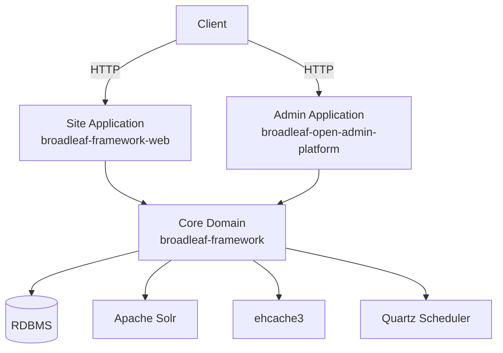
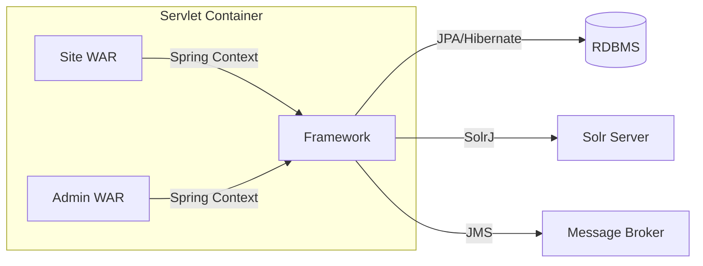
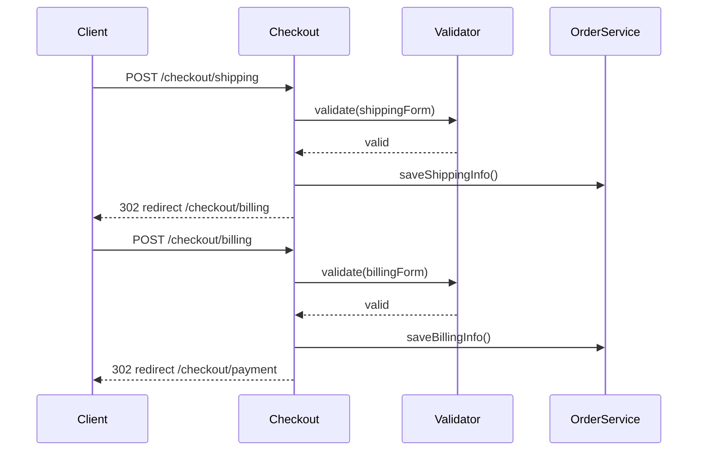

# Broadleaf Commerce — Developer Onboarding Guide

**Repository:** https://github.com/johrenberger/BroadleafCommerce  
**Commit:** `8645873661b34fe0954cebe382aba59336714db0`  
**Generated:** 2026-06-06

---

## 1. README / Instruction Files Summary

Broadleaf Commerce CE is an enterprise Java e-commerce framework built on Spring. Key points:

- **License:** Fair Use dual-license (not Apache 2 open source)
- **Target:** Companies with < $5M revenue
- **Architecture:** Traditional unified codebase with `site` and `admin` deployment sharing core
- **Key Technologies:** Spring 6.2.18, Spring Security 6.5.10, Hibernate 5.6.15.Final, Solr, Quartz, Thymeleaf
- **Getting Started:** https://www.broadleafcommerce.com/docs/core/current/tutorials/getting-started-tutorials

---

## 2. Detailed Technology Stack

| Component | Technology | Version |
|-----------|------------|---------|
| Language | Java | 17 |
| Framework | Spring | 6.2.18 |
| Security | Spring Security | 6.5.10 |
| ORM | Hibernate (JPA) | 5.6.15.Final |
| Database | Any JPA-compatible RDBMS | — |
| Search | Apache Solr | 9.9.0 (solr-solrj client) |
| Scheduling | Quartz |2.5.2 |
| Caching | ehcache3 | 3.10.8 |
| Build | Maven | 3.x |
| Testing | JUnit 4, Spock2, Geb | various |
| Email | Spring Mail + JMS | — |
| LDAP | Spring LDAP | 3.3.6 |
| OAuth2 | Spring Security OAuth2 Client | 6.5.10 |
| Logging | SLF4J + Logback | 2.0.17 / 1.5.32 |

---

## 3. System Overview and Purpose

Broadleaf Commerce CE is a framework for building enterprise e-commerce sites. It provides:

- **Catalog Management** — Products, SKUs, categories, options
- **Cart & Checkout** — Multi-stage checkout with payment integration
- **Order Management** — Order processing, fulfillment, status tracking
- **Customer Management** — Registration, login, addresses, saved payments
- **Promotions** — Rule-based promotions via MVEL expressions
- **Content Management** — CMS pages, targeted content
- **Admin Platform** — Admin UI for managing catalog, orders, customers

This is a **framework/library**, not a standalone application. Implementers include Broadleaf JARs as dependencies and configure Spring application context.

---

## 4. Project Structure and Reading Recommendations

```
BroadleafCommerce/
├── pom.xml                  # Root Maven POM (version 7.0.8-SNAPSHOT)
├── common/                  # broadleaf-common — shared utilities
├── core/
│   ├── broadleaf-framework/           # Domain entities, services, workflows
│   ├── broadleaf-framework-web/       # Web layer (MVC controllers, processors)
│   ├── broadleaf-profile/            # Customer profile domain
│   └── broadleaf-profile-web/        # Profile web (registration, login)
├── admin/
│   ├── broadleaf-admin-module/               # Admin order/customer management
│   ├── broadleaf-contentmanagement-module/  # CMS
│   ├── broadleaf-open-admin-platform/       # Admin UI platform
│   └── broadleaf-admin-functional-tests/    # Selenium/Geb functional tests
├── integration/              # Integration tests
├── docs/                    # ADR files
└── Jenkinsfile             # Jenkins CI configuration
```

**Reading Order:**
1. `core/broadleaf-framework-web/src/main/java/org/broadleafcommerce/core/web/controller/` — Understand request handling
2. `core/broadleaf-framework/src/main/java/org/broadleafcommerce/core/` — Core domain model
3. `core/broadleaf-profile/src/main/java/org/broadleafcommerce/profile/` — Customer management
4. `admin/broadleaf-open-admin-platform/src/main/java/org/broadleafcommerce/openadmin/` — Admin UI

---

## 5. Key Components

### Web Controllers (broadleaf-framework-web)
- `BroadleafCartController` — Cart operations
- `BroadleafCheckoutController` — Multi-stage checkout
- `BroadleafShippingInfoController` / `BroadleafBillingInfoController` / `BroadleafPaymentInfoController` — Checkout stages
- `BroadleafCatalogController` / `BroadleafProductController` / `BroadleafCategoryController` — Catalog browsing
- `BroadleafSearchController` — Solr-powered search
- `BroadleafLoginController` / `BroadleafRegisterController` — Authentication

### Admin Controllers (broadleaf-open-admin-platform)
- `EntityController` — Entity CRUD operations
- `ModuleController` — Admin module navigation

### Domain Entities (broadleaf-framework)
- **Order:** `Order`, `OrderItem`, `FulfillmentGroup`, `PaymentInfo`
- **Catalog:** `Product`, `Sku`, `Category`, `ProductOption`
- **Profile:** `Customer`, `Address`, `CustomerPayment`

### Core Services
- `OrderService` — Order management
- `CartService` — Cart operations
- `PricingService` — Price calculation with promotions
- `FulfillmentService` — Shipping calculation
- `InventoryService` — Stock management
- `PaymentService` — Payment processing

### Security
- `BroadleafAuthenticationSuccessHandler` — Post-login cart merge
- `CartStateFilter` — Cart state management
- `XssFilter` — XSS attack prevention

---

## 6. Execution and Data Flows

### Authentication Flow
1. User submits login → `BroadleafLoginController`
2. Spring Security validates credentials
3. `BroadleafAuthenticationSuccessHandler` merges guest cart with user cart
4. Session created with customer association

### Cart Flow
1. `BroadleafCartController.addCartItem()` receives SKU ID and quantity
2. `CartService.addItem()` validates inventory
3. `PricingService.applyPricing()` calculates price (including promotions)
4. Order updated in database

### Checkout Flow
1. **Info Stage** → **Shipping** → **Billing** → **Payment** → **Confirmation**
2. Each stage validated by corresponding form validator
3. `OrderService.saveOrder()` persists final order
4. `PaymentService.processPayment()` charges payment
5. Inventory decremented, confirmation displayed

### Search Flow
1. `BroadleafSearchController` receives query
2. `SearchService` sends to Solr via SolrJ
3. Faceted results returned with filters

---

## 7. Database Schema Overview

**Type:** Relational (any JPA-compatible RDBMS)  
**ORM:** Hibernate 5.6.15.Final with JPA annotations  
**Test DB:** HSQLDB (in-memory)

### Key Entities

| Domain | Entities |
|--------|----------|
| Order | Order, OrderItem, FulfillmentGroup, FulfillmentGroupItem, PaymentInfo, OrderLock |
| Catalog | Product, Sku, Category, ProductOption, ProductOptionValue, CrossSellProduct |
| Profile | Customer, Address, CustomerPayment |
| CMS | Page, ContentField, ContentRule |

### Schema Management
- JPA entity annotations define schema
- No Flyway/Liquibase migration files found
- Schema likely managed via manual SQL patches or JPA `hbm2ddl.auto`

---

## 8. Dependencies and Integrations

| Integration | Technology | Purpose |
|-------------|------------|---------|
| Search | Apache Solr 9.9.0 | Faceted product search |
| Job Scheduling | Quartz 2.5.2 | Abandoned cart emails, etc. |
| Email | Spring Mail + JMS | Transactional emails |
| Caching | ehcache3 3.10.8 | Hibernate L2 cache, result cache |
| LDAP | Spring LDAP 3.3.6 | Admin authentication |
| OAuth2 | Spring Security OAuth2 Client | Social login |
| Content | Apache Tika 3.2.3 | File metadata extraction |

**No external API integrations** — This is a local framework.

---

## 9. API Documentation

Broadleaf Commerce CE is a **framework**, not an API-first platform. The API is in Java method calls.

### HTTP Endpoints (Spring MVC)

| Pattern | Description |
|---------|-------------|
| `/cart` | Cart operations |
| `/checkout` | Multi-stage checkout |
| `/checkout/shipping` | Shipping info |
| `/checkout/billing` | Billing info |
| `/checkout/payment` | Payment info |
| `/account` | Login, register, profile |
| `/catalog` | Products, categories |
| `/search` | Search results |
| `/admin` | Admin home |
| `/admin/entity` | Entity CRUD |

### Service APIs (Java)

- `OrderService`, `CartService`, `PricingService`, `FulfillmentService`, `InventoryService`, `PaymentService`, `CustomerService`

### Extension Pattern

`ExtensionManager` + `ExtensionHandler` — Handlers called in sequence until one handles the request.

---

## 10. Architecture Diagrams

### Component Diagram


### Deployment Diagram


### Checkout Flow


---

## 11. Testing

**Test Frameworks:** JUnit 4, Spock 2 (Groovy), Geb (browser automation)

**Commands:**
```bash
mvn test                    # All tests
mvn test -pl core/broadleaf-framework-web  # Specific module
mvn integration-test       # Integration tests
```

**CI:** Maven Surefire + JaCoCo for coverage, OWASP Dependency Check via `security-check` profile

**Test Structure:**
- `core/broadleaf-framework-web/src/test/groovy/` — Spock BDD tests
- `admin/broadleaf-admin-functional-tests/` — Selenium/Geb functional tests

---

## 12. Error Handling and Logging

- **Error Handling:** Spring MVC `@ExceptionHandler` methods, custom exception classes like `OrderLockAcquisitionFailureException`
- **Input Validation:** JSR-303 Bean Validation + custom `blcValidator` form validators
- **XSS Prevention:** `XssFilter` + `XssRequestWrapper`
- **Logging:** SLF4J 2.0.17 + Logback 1.5.32 (configuration not reviewed)
- **No structured observability** — No metrics, no distributed tracing

---

## 13. Security Considerations

- **Auth:** Spring Security 6.5.10, session-based for site, LDAP/database for admin
- **XSS:** `XssFilter` sanitizes request parameters
- **SQL Injection:** JPA prepared statements throughout
- **PCI:** Payment data referenced separately, encryption scheme API, verbose logging
- **OAuth2:** Social login via `spring-security-oauth2-client`
- **No RBAC** — Admin permission system via `AdminSecurityConfig`

---

## 14. Architecture Risks and Observations

| Risk | Severity | Category |
|------|----------|----------|
| No database migration system | Medium | Reliability |
| No explicit API documentation | Medium | Developer Experience |
| No distributed tracing | Medium | Operational |
| No structured logging | Medium | Operational |
| No metrics/observability | Medium | Operational |
| Large codebase (~3000 files) | Medium | Maintainability |
| Dual license complexity | Medium | Legal |

---

## 15. Developer Productivity Guide

### First-Week Reading Order
1. README.md — Project overview
2. `core/broadleaf-framework-web/src/main/java/org/broadleafcommerce/core/web/controller/cart/BroadleafCartController.java` — Cart handling
3. `core/broadleaf-framework/src/main/java/org/broadleafcommerce/core/order/domain/Order.java` — Core order entity
4. `core/broadleaf-framework-web/src/main/java/org/broadleafcommerce/core/web/controller/checkout/` — Checkout flow
5. `admin/broadleaf-open-admin-platform/` — Admin structure

### Fastest Local Startup
```bash
# Clone and build
git clone https://github.com/johrenberger/BroadleafCommerce.git
cd BroadleafCommerce
mvn clean install -DskipTests

# Configure in your application
# (Broadleaf is a library, not a runnable app)
```

### Debugging Entry Points
- Add breakpoints in `BroadleafCartController` for cart issues
- Add breakpoints in `CheckoutFormService` for checkout issues
- Enable SQL logging: `hibernate.show_sql=true`
- Check `XssFilter` for XSS-related issues

### Common Extension Points
- Implement `ExtensionHandler` for custom behavior
- Override Spring beans in application context
- Use `blcVariableExpression` Thymeleaf extension for custom template variables

---

## 16. Build / Deploy / Infrastructure

**Build:** Maven 3.x
```bash
mvn clean install              # Full build
mvn clean install -DskipTests # Skip tests
mvn -pl core/broadleaf-framework-web clean package # Single module
```

**Deployment:** WAR packaging to servlet container (Tomcat, Jetty, Undertow)

**CI:** Jenkins (`Jenkinsfile` present), GitHub Actions (PR template only)

**Database:** Any JPA-compatible RDBMS (PostgreSQL, MySQL, Oracle, SQL Server)

**Required Infrastructure:**
- RDBMS
- Apache Solr (search)
- (Optional) JMS message broker for async email

---

## 17. ADR Baseline

- [docs/adr/000-template.md](https://github.com/johrenberger/BroadleafCommerce/blob/8645873661b34fe0954cebe382aba59336714db0/docs/adr/000-template.md)
- [docs/adr/001-current-architecture-baseline.md](https://github.com/johrenberger/BroadleafCommerce/blob/8645873661b34fe0954cebe382aba59336714db0/docs/adr/001-current-architecture-baseline.md)

---

## 18. Discovery Confidence and Unknowns

| Category | Confidence | Notes |
|----------|------------|-------|
| Architecture | High | Traditional Java monolith confirmed |
| Business Logic | High | Core e-commerce domains well-understood |
| Security | Medium | Auth reviewed; no penetration testing |
| Deployment | Medium | Jenkinsfile present; Docker not in this repo |
| Testing | Medium | JUnit/Spock confirmed; CI details unclear |
| Data | High | JPA entities reviewed; migrations not explicit |

**Overall Discovery Confidence:** High

### Top 5 Files to Read First
1. [core/broadleaf-framework-web/src/main/java/org/broadleafcommerce/core/web/controller/cart/BroadleafCartController.java](https://github.com/johrenberger/BroadleafCommerce/blob/8645873661b34fe0954cebe382aba59336714db0/core/broadleaf-framework-web/src/main/java/org/broadleafcommerce/core/web/controller/cart/BroadleafCartController.java) — Cart handling
2. [core/broadleaf-framework/src/main/java/org/broadleafcommerce/core/order/domain/Order.java](https://github.com/johrenberger/BroadleafCommerce/blob/8645873661b34fe0954cebe382aba59336714db0/core/broadleaf-framework/src/main/java/org/broadleafcommerce/core/order/domain/Order.java) — Core order entity
3. [core/broadleaf-framework-web/src/main/java/org/broadleafcommerce/core/web/controller/checkout/](https://github.com/johrenberger/BroadleafCommerce/blob/8645873661b34fe0954cebe382aba59336714db0/core/broadleaf-framework-web/src/main/java/org/broadleafcommerce/core/web/controller/checkout/) — Checkout flow
4. [pom.xml](https://github.com/johrenberger/BroadleafCommerce/blob/8645873661b34fe0954cebe382aba59336714db0/pom.xml) — All dependencies and versions
5. [docs/adr/001-current-architecture-baseline.md](https://github.com/johrenberger/BroadleafCommerce/blob/8645873661b34fe0954cebe382aba59336714db0/docs/adr/001-current-architecture-baseline.md) — Architecture summary

### Unknowns / Limitations
- Exact database migration strategy not explicit
- Docker/docker-compose not in this repo (may be in implementer projects)
- Python e2e tests not confirmed in this repo
- WebSocket usage not confirmed
- Specific CI/CD pipeline details not reviewed